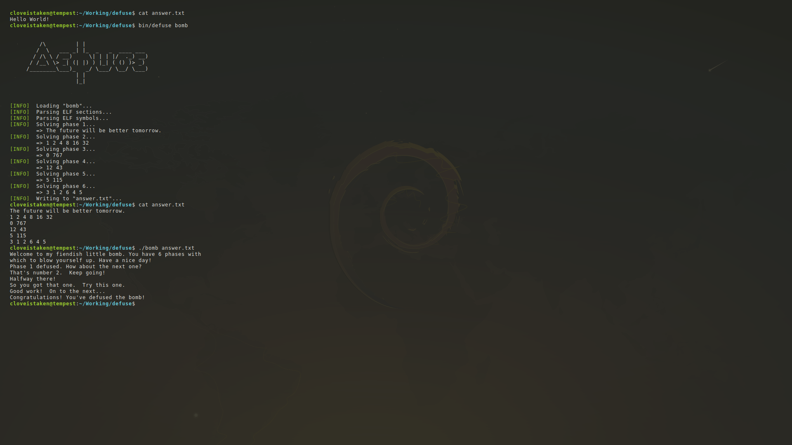

# Defuse for Bomb Lab




### What is this ?

Defuse is a solver for the Binary Bomb Lab from the book CS:APP2e, Carnegie Mellon University.
The program uses static analysis combined with brute-forcing to find the answer for all 6 phases of the bomb.

__Curent version: 0.99__: Passes all current tests, need to test from more sources


### Install

The preferred method of installation is from the source code.
All you need is a 64-bit Linux system with GCC (clang should also work here but I haven't tested myself).

```
git clone https://github.com/cloveistaken/defuse
cd defuse
make
```


### Usage

I choose not to include any fancy CLI arguments here, so you just need to do
```
bin/defuse <bomb>
```

Very simple.
The solver works for both online bomb and offline bomb.
If you want to see some debug messages, run `bin/defuse-debug` instead.

_Note_: The binary bomb has to be 64-bit ELF. The solver does not modify the main binary directly in anyway.


### FAQ

#### Why does this program exist ?

I've always wanted to write a ELF header parser in pure C, but I want to write something more meaningful than just a toy program.
The binary bomb itself is simple to reverse, quite static, not stripped and not obfuscated.
What can be more fitting ?

#### How does it work ?

To put it simply, I study for patterns in a lot of bombs beforehand, and now I just write a program that brute-force the solutions.
This is not a magic bullet, a fancy decompiler or anything, sadly.
For a bit more technical description, I have written a small blog post [here](#) (Updated: Dead link, will remake a new one in the future).

#### It doesn't work with my binary bomb.

I'm sorry to hear that.
As I mentioned above, the solver doesn't do anything fancy aside from brute-forcing.
This means your bomb might be an edge case that I haven't seen, I'd love to see it so I could improve this program.

#### My bomb has more than 6 phases

From what I've seen, there are variants of the original assignment from CMU.
Unfortunately, I'm not familiar with such versions in any means, and this solver is created with the intention of solving the 6-phase version only.


### Disclaimer

This program source code is provided as is.
I am not responsible for any of your consequences from using this solver.
I do not wish to engage into any arms race.
This means if your teacher modifies the bomb generator specifically so this solver does not work, I would not update the program accordingly.


### License

GNU General Public License v3.0
